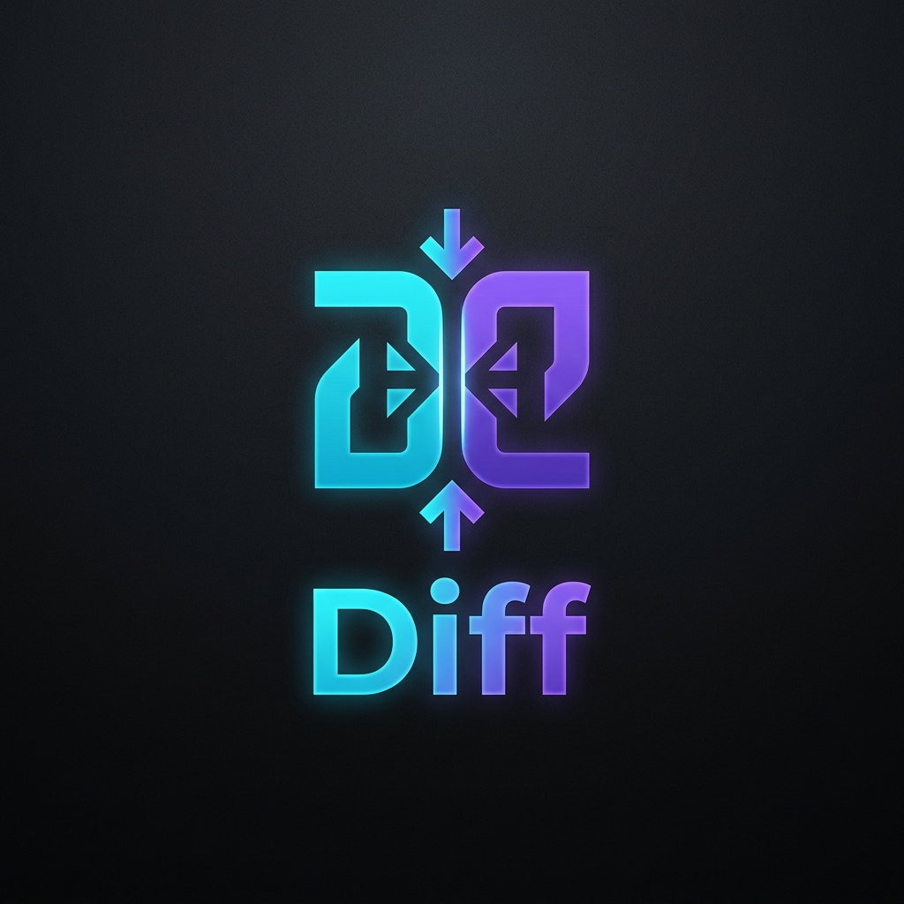

# Diffy

**Premium Code Comparison. Instant & In your browser.**

[Ver en GitHub Pages](https://manuamest.github.io/diff-checker/)

Diffy is a lightweight, incredibly fast, and beautiful code comparison tool built to run entirely on the client side. No servers, no installation, just drop your code and see the diff instantly.

*(Note: Record a short screen capture of Diffy in action, convert it to a `.gif`, and save it as `demo.gif` in the `assets/` folder to display it here. Alternatively, you can edit this file directly on the GitHub website and drag-and-drop an `.mp4` video!)*

## How it works

Since Diffy is a 100% static application, using it is as simple as it gets:

1. Open [Diffy](https://manuamest.github.io/diff-checker/) in your web browser.
2. Paste your original code in the left panel.
3. Paste your modified code in the right panel.
4. The differences are highlighted instantly using the powerful Monaco Editor engine (the same engine powering VS Code).

That's it. No config needed. No data leaves your browser.

## Features

- **Monaco Editor Engine:** Provides VS Code-level diffing, syntax highlighting, and native clipboard integration.
- **Split & Inline Views:** Toggle between side-by-side or unified view with a single click.
- **Dark/Light Mode:** Seamlessly switch between themes.
- **Privacy First:** 100% client-side. Your code never leaves your computer.
- **Ultra Lightweight:** No build tools, no Node.js required to run. Just pure HTML, CSS, and JS.

## Contributing

We welcome contributions! Please see our [Contributing Guidelines](./CONTRIBUTING.md) for details on how to get started.

1. Fork the project
2. Create your feature branch (`git checkout -b feature/AmazingFeature`)
3. Commit your changes (`git commit -m 'Add some AmazingFeature'`)
4. Push to the branch (`git push origin feature/AmazingFeature`)
5. Open a Pull Request

## License

This project is totally open-source and licensed under the [MIT License](./LICENSE).
